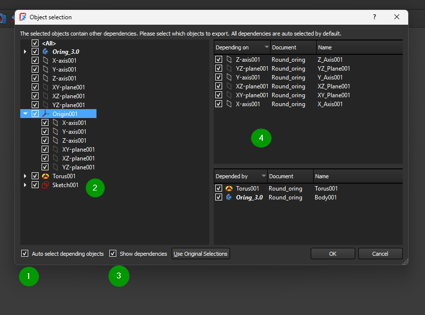

# Duplicating a Body (Including Dependencies)

This section completes an important **missing step** in the duplication process:
the **Object Selection** dialog that appears when you copy a Body.

The goal here is **not** to analyze every dependency, but to understand *what to click* and *why*.

---

## Fastest way to duplicate a Body (safe method)

1. Select the **Body** you want to copy  
2. Press **Ctrl + C**  
3. Review the **Object Selection** dialog (Figure 1)  
4. Click **OK**  
5. Press **Ctrl + V**  
6. Rename the new Body immediately

---

## The Object Selection dialog (what this is)

When you copy a Body, FreeCAD checks whether that Body relies on other objects
(sketches, reference geometry, origins).

Instead of guessing, FreeCAD shows you this dialog so it can copy **everything required**
to keep the new Body fully functional.

You do **not** need to understand every item listed to use this safely.

---

## How to use the dialog (recommended settings)

*Figure 1 – Object Selection dialog when copying a Body*

### A — Auto Select Depending Objects

When enabled, FreeCAD automatically selects:
- the Body
- its sketches
- any reference geometry it relies on

This is what you want **almost all of the time**.

### B — Show Dependencies

When enabled, FreeCAD displays *why* items are selected by showing:
- **Depending on**: objects this Body uses
- **Depended by**: objects that use this Body

This is for visibility only — you do not need to change anything here.

### Dependency panels (right side)

The two panels on the right explain relationships:
- **Depending on** lists references required by the Body
- **Depended by** lists objects that rely on the Body

These lists explain *why* FreeCAD selected certain items automatically.
They are informational and safe to ignore for basic duplication.

---

## IMPORTANT NOTE

⚠️ **Do NOT click “Use Original Selections”**

That option disables automatic dependency handling and is intended for
advanced workflows. It will be covered later.

For normal duplication, leave:
- **Auto Select Depending Objects** ON
- **Show Dependencies** ON
- Click **OK**

---

## Final steps

4. Press **Ctrl + V** to paste  
5. Rename the new Body:
   - Right-click → **Rename**
   - or press **F2**

Rename immediately so you don’t accidentally edit the wrong version.

---

## Key takeaway

The Object Selection dialog exists to **protect your model**.

If you accept the defaults and click **OK**, you get a clean,
fully-independent duplicate of the Body every time.
